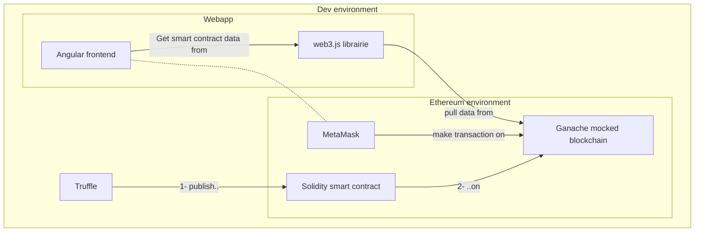

```mermaid
graph TD

  truffle[Truffle]
  ganache[Ganache mocked blockchain]
  web3[web3.js librairie]
  metamask[MetaMask]
  solidity[Solidity smart contract]
  angular[Angular frontend]

	subgraph Dev environment
	truffle

	subgraph Webapp
		angular
		web3
	end

	subgraph Ethereum environment
		ganache
		metamask
		solidity
	end

	angular -- Get smart contract data from --> web3
	web3 -- pull data from --> ganache
	angular -.-  metamask
	truffle -- 1- publish.. --> solidity
	solidity -- 2- ..on --> ganache
	metamask -- make transaction on --> ganache
end
```