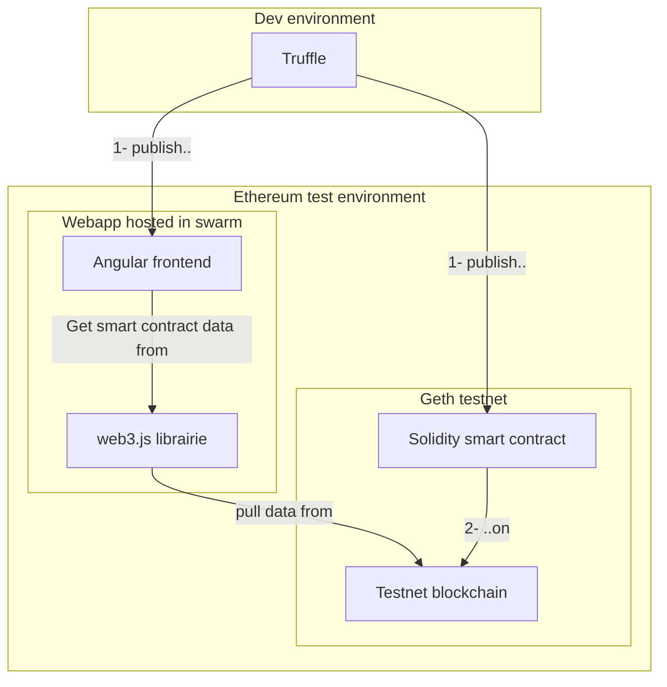

```mermaid
graph TD
  truffle[Truffle]
  web3[web3.js librairie]
  angular[Angular frontend]
  solidity[Solidity smart contract]
  blockchain[Testnet blockchain]

  subgraph Dev environment
    truffle
  end

  subgraph Ethereum test environment
    subgraph Webapp hosted in swarm
      angular
      web3
    end

    subgraph Geth testnet
      solidity
      blockchain
    end

  end

  angular -- Get smart contract data from --> web3
  web3 -- pull data from --> blockchain
  truffle -- 1- publish.. --> solidity
  solidity -- 2- ..on --> blockchain
  truffle -- 1- publish.. --> angular
```